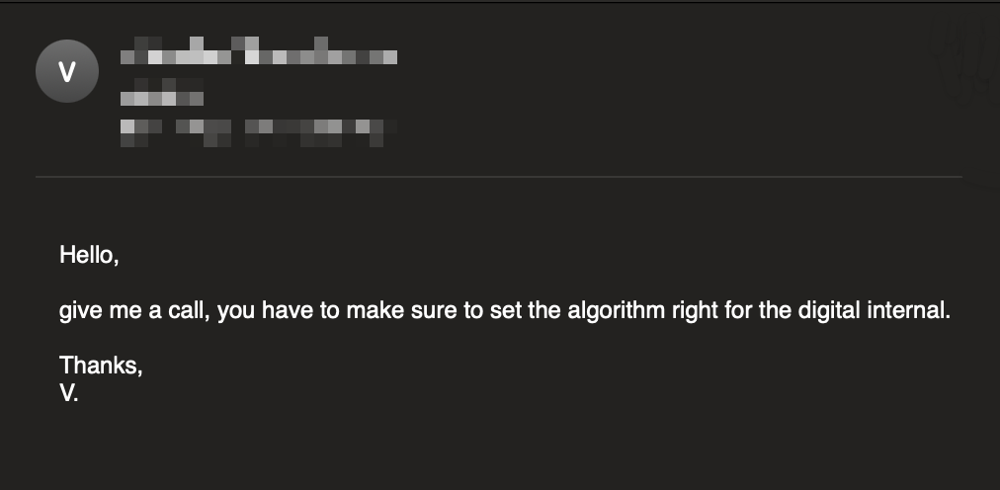

# Spam-O-Matic 3000



Automate your email game with random phrases that sound smart and urgent!

- [Spam-O-Matic 3000](#spam-o-matic-3000)
  - [Features](#features)
  - [TL;DR Setup](#tldr-setup)
  - [Usage](#usage)
  - [Test](#test)


## Features
- Fetches random phrases from two distinct APIs: **Corporate BS Generator**, **Techy API**.
- Automatically creates an email body using the fetched API data.
- Uses regular expressions to validate email addresses.
- Sends the generated email via Gmail's SMTP server.
- Command Line Interface.
- Includes error handling for failed API requests and email sending.
- Uses an environment variable to securely handle the Gmail password.
- Includes tests.

## TL;DR Setup

1. Execute the following:

    ```sh
    git clone git@github.com:viliusddd/email-api.git && \
    cd email-api && \
    cp .env.example .env && \
    python -m venv .venv && \
    . .venv/bin/activate && \
    pip install -r requirements.txt
    ```
2. Replace `.env` values:

   - **SENDER_EMAIL**: gmail email address.
   - **SENDER_APP_PASS**: password from `https://myaccount.google.com/apppasswords`.

## Usage

- **email**: receiver email.
- **api_name**: either `techy` or `corporatebs`.

```sh
python email_api.py <email> <api_name>
```

## Test

```sh
pytest test_email_api.py
```
